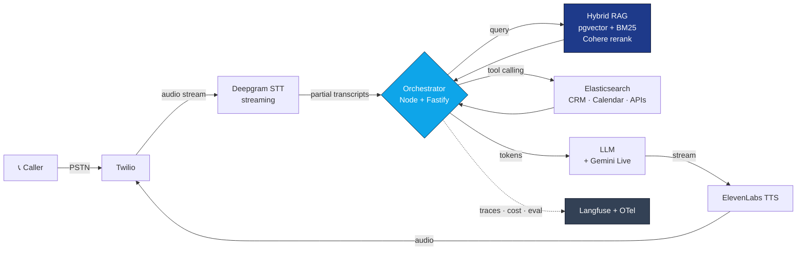
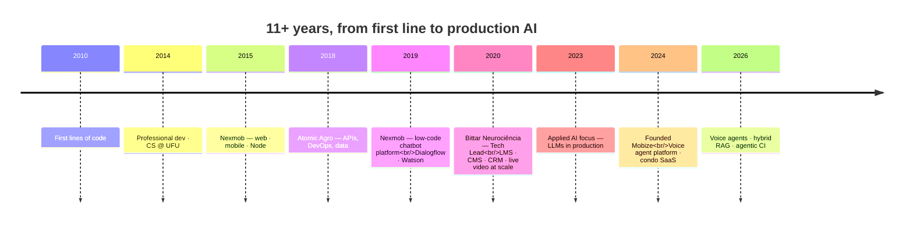

<div align="center">


<a href="https://github.com/maateusx">
  
</a>

<br/>

<a href="https://www.linkedin.com/in/maateusx/"></a>
<a href="mailto:mateus1128@gmail.com"></a>
<a href="./COVER_LETTER.md"></a>


</div>

---

## `whoami`

<table>
<tr>
<td width="58%" valign="top">

```ts
const mateus = {
  role:      "Senior Fullstack / Applied AI Engineer",
  location:  "Uberlândia, MG 🇧🇷 — remote-first, EN C1",
  since:     { coding: 2010, professional: 2014, techLead: 2020, appliedAI: 2023 },
  founder:   "Mobize Tecnologia",
  stack:     ["TypeScript", "Node + Fastify", "React / Next.js", "Python", "PostgreSQL + pgvector", "AWS"],
  shipping:  ["voice & chat agent platform", "condo management SaaS", "AI deals platform"],
  belief:    "Specs first. Systems thinking is why my AI work reaches production.",
} as const;
```

</td>
<td width="42%" valign="top" align="center">


<sub><i>where most of the work happens</i></sub>

</td>
</tr>
</table>

<div align="center">

</div>

---

## 🎙️ What I actually build

<table>
<tr>
<td width="50%" valign="top">

### Real-time voice agents
Sub-**900ms** end-to-end conversational loops over real telephony — turn-taking, barge-in, tool calling mid-call.

`Twilio` `Deepgram` `Gemini Live` `ElevenLabs`

</td>
<td width="50%" valign="top">

### Hybrid RAG in production
Semantic + BM25 retrieval with Cohere reranking, tenant-isolated, grounded answers over each customer's own knowledge base.

`pgvector` `Elasticsearch` `Supabase`

</td>
</tr>
<tr>
<td width="50%" valign="top">

### LLM observability & eval
Traces, cost attribution, quality scoring and regression suites — so model changes are measured, not vibed.

`Langfuse` `OpenTelemetry` `RAGAS`

</td>
<td width="50%" valign="top">

### Agentic engineering
Multi-agent workflows and CI pipelines where AI agents open and review merge requests.

`Claude Code (headless)` `MCP` `CrewAI` `LangChain`

</td>
</tr>
</table>

<details>
<summary><b>🔊 How a call actually flows (click to expand the architecture)</b></summary>

<br/>



**The hard part isn't the LLM call.** It's the budget: every hop above has to fit inside ~900ms or the human on the phone hears a pause and starts talking over the agent. Barge-in detection, speculative TTS, and cutting a retrieval round-trip are where the engineering lives.

</details>

---

## 🚀 Products I own end to end

<details open>
<summary><b>TakeSales / TakeFlow AI</b> — multi-tenant voice & chat agent platform <sub>(Founder · technical lead)</sub></summary>

<br/>

> A VAPI/Retell competitor built for the Brazilian market. Customers build, deploy and operate conversational agents wired into real phone lines, grounded in their own knowledge base.

| | |
|---|---|
| **Latency** | sub-900ms end-to-end voice loop |
| **Retrieval** | hybrid RAG (pgvector + keyword), tenant-isolated |
| **Observability** | Langfuse traces + cost, OpenTelemetry distributed tracing |
| **Infra** | AWS ECS Fargate · SQS · CloudFront · WAF · automated CI/CD |
| **Design system** | *The Quiet Machine* (in-house) |

**Case study — a real-estate AI SDR agent:** qualifies inbound leads and searches live property inventory via Elasticsearch *during* the conversation, with prompts tuned for Brazilian Portuguese.

</details>

<details>
<summary><b>Condo management SaaS</b> — multi-tenant platform for building managers <sub>(Founder · technical lead)</sub></summary>

<br/>

Digitizes an entire regulated domain — resident communication, finance, bookings, incidents, documents and assemblies — with an AI layer that **generates, summarizes and answers questions over meeting minutes** via RAG.

- Multi-tenant architecture with per-condominium data separation and role-based authorization
- Translating quorums, cost apportionment and financial reporting into something non-technical users actually use
- TypeScript end to end · Fastify · Next.js · Supabase/pgvector · AWS

</details>

<details>
<summary><b>AI deals & coupons platform</b> — crawler-to-search pipeline at scale <sub>(architected end to end)</sub></summary>

<br/>

```
crawlers → AWS SQS → workers → OpenAI enrichment → PostgreSQL → Fastify API → Next.js
```

- **SEO as a first-class pillar:** SPA → Next.js SSR/ISR migration, sitemaps, Schema.org structured data, dynamic metadata
- MongoDB → PostgreSQL (Prisma) migration for consistency and complex queries
- Price history, voting/comments, hybrid search, community spaces, affiliate monetization

</details>

<details>
<summary><b>Everything else in flight</b> — 8 more projects</summary>

<br/>

| Project | What it is | Status |
|---|---|---|
| **Treinou.app** | Fitness accountability app · ASO + store listing | Publishing |
| **claude-kanban** | Local kanban with markdown as source of truth; headless Claude Code, planner/scorer agents | Evolving → BYOM SaaS |
| **Licitações AI** | Public-tender opportunity discovery pipeline on real data | Running locally |
| **Sereno** | AI journaling / emotional wellbeing, reusing TakeFlow infra | Spec / MVP |
| **Virtual Staging MVP** | AI virtual staging for real estate | MVP |
| **MCP Orchestration Gateway** | Gateway architecture for MCP orchestration | Architecture |
| **AI CMO** | Internal multi-product social media management | Internal |
| **Meeting-minutes AI** | Condo minutes generation & Q&A (Skip Challenge hackathon) | Hackathon |

</details>

---

## 🧰 Toolbox

<div align="center">


</div>

<details>
<summary><b>The honest breakdown — depth vs. familiarity</b></summary>

<br/>

**Daily driver, deep:** TypeScript · Node.js + Fastify · React/Next.js (App Router, RSC, SSR/ISR/SSG) · PostgreSQL/Supabase + pgvector · AWS (ECS Fargate, Lambda, SQS, S3, CloudFront, WAF, RDS) · Docker · GitHub Actions

**Applied AI, in production:** LLM orchestration & tool calling · multi-agent workflows · hybrid RAG · Deepgram/ElevenLabs/Gemini Live · Twilio · Langfuse · OpenTelemetry · RAGAS · MCP · Claude Code headless

**Strong:** Python · React Native · Flutter · Kubernetes · Elasticsearch · MongoDB · Prisma · TailwindCSS/Shadcn · Zustand · React Query · WebSockets

**Have shipped with, rustier:** PHP · Java · Oracle · SQL Server · AngularJS · Appium/Selenium

**Conversational AI lineage:** Dialogflow & IBM Watson since **2019** → production LLMs since **2023**. Not a 2024 pivot.

</details>

---

## 📊 The numbers

<div align="center">


</div>

---

## 🗺️ Career timeline



---

## 🏆 Beyond the code

<table>
<tr><td>🥉</td><td><b>3rd place</b> — Hackatri (Tribanco Hackathon)</td></tr>
<tr><td>🏅</td><td><b>50 Best Apps of the Year</b> (2015)</td></tr>
<tr><td>🎖️</td><td>Honorable mention ×2 — Brazilian Public School Math Olympiad</td></tr>
<tr><td>🔭</td><td>Honorable mention — Brazilian Astronomy & Astronautics Olympiad</td></tr>
<tr><td>⚛️</td><td>Senior React Engineer — Triplebyte Certified</td></tr>
<tr><td>🎓</td><td>BSc Computer Science, <b>UFU</b> · Postgrad in Generative AI Applications (2025–2026)</td></tr>
</table>

<details>
<summary><b>♟️ Off the clock</b></summary>

<br/>

Chess (competitive streak included), running and lifting, DIY and metalworking, film, games. The common thread is the same one in my engineering: I like systems with hard constraints and no room to hand-wave.

</details>

---

## 🤝 How I work

> **Structured specs first.** I turn problems into dense documents before writing code — which is exactly why coding agents work well for me instead of flailing.

- Simple before clever. Clean, readable code that the next person can own.
- Performance work when it moves a real number, not for sport.
- Scalability designed in from day one; APIs that are boring to consume.
- Understand the business problem *before* the implementation.
- Direct, honest assessment — I'd rather be corrected than validated.
- Stack choices driven by delivery speed and cost, not hype.

---

<div align="center">

### Open to Applied AI / Senior Fullstack / Tech Lead roles — remote-friendly

📄 **[Read my cover letter →](./COVER_LETTER.md)**

<a href="https://www.linkedin.com/in/maateusx/"></a>
<a href="mailto:mateus1128@gmail.com"></a>


</div>
